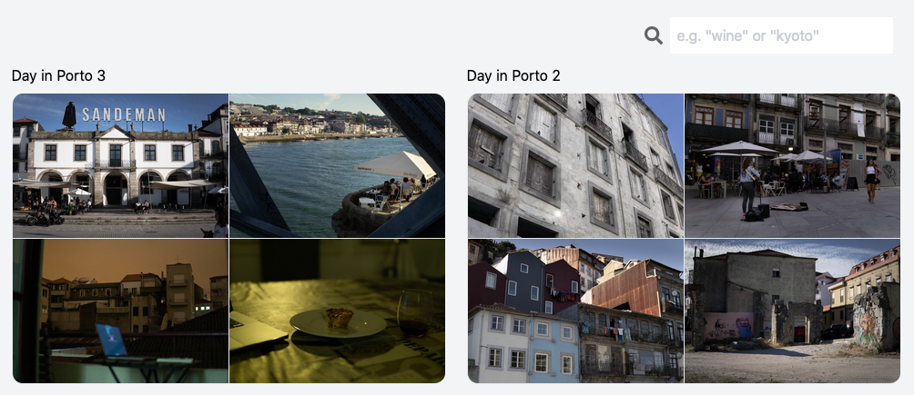

## Image sharing site

http://notwilli.am

Features:
- Clean UI
- Organise photos into twitter-style posts of up to 4 images
- Database management of photos and metadata like location and exif data
  (shutter speed, time taken, etc.)
- Deep learning object detection

Todo:
- Add friendly upload form
- Add scene classificaiton
- Make API publicly accessable. Then you will be able to use the API backend while hosting the frontend yourself (works on github pages)
